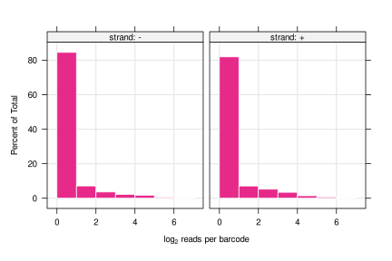

TnSeq data processing workflow
================================
Michael Jahn, Johannes Asplund-Samuelsson

### Description

The purpose of the following guide is to provide a simple, step-wise procedure for **Tn-Seq data analysis**. Tn-Seq (transposon sequencing) is the mapping of barcoded transposons to positions in a reference genome. This is the first of two major steps when analyzing barcoded transposon libraries. The second step is the extraction, PCR amplification, and sequencing of the already mapped barcodes from a transposon mutant library (see [Price et al., Nature, 2018](http://www.nature.com/articles/s41586-018-0124-0)). The initial steps of processing next generation sequencing data was directly adapted from [Morgan Price's Feba repository](https://bitbucket.org/berkeleylab/feba/src/master/). The user is referred to the Feba repository or the original Tn-BarSeq publications for further information.

### Prerequisites

- Linux environment with `bash`, `perl` installed
- a DNA alignment software, the default here is `blat`. It can be downloaded [here](http://hgdownload.soe.ucsc.edu/downloads.html#source_downloads) and should placed in `feba/bin/`
- Perl scripts from [Morgan Price's Feba repository](https://bitbucket.org/berkeleylab/feba/src/master/), A. Arkin lab, Berkeley (see `feba/bin/`)
- `Fastq` sequencing data as obtained from Illumina runs (see `data/fastq`)
- Reference genome in `.fasta` format (stored in `ref/`, see description next section)
- Model file containing the structure of the read (see `MODELS` file in `feba/primers/`for more documentation)

### Step 1: Retrieving data from Illumina basespace *via* command line (optional)

Data in form of `*.fastq` files can be manually downloaded from the basespace website on MacOS or Windows.
For Linux systems, only the command line option is available via Illumina's BaseSpace Sequence Hub CLI (can be downloaded [here](https://developer.basespace.illumina.com/docs/content/documentation/cli/cli-overview)). Files can be downloaded in `.fastq.gz` format for each biosample separately by executing the following line in a terminal and replacing `<your-biosample-ID>` with the number you will find in the URL of your browser. For example, log in to basespace, navigate to your run, then to `biosamples`, select a biosample and copy the ID you find in the URL: `https://basespace.illumina.com/biosamples/568408389`. Note that the files are subdivided per lane. More information can be found [here](https://developer.basespace.illumina.com/docs/content/documentation/cli/cli-examples).

```
bs download biosample -i <your-biosample-ID> -o ./your/target/directory/
```

### Step 2: Prepare reference genome table

Download the genome table of choice in RefSeq format (`*.gff` file) from NCBI genome and save it to `ref/`. In order to run the next steps of the mapping procedure, the table needs to be trimmed and locus tags (gene IDs) need to be extracted. The R script to do this for all reference genomes in `ref/` is located in `docs/prepare_ref_genome.Rmd`. It simply needs to be executed in Rstudio (recommended) or an R console. Note that line 47 and 48 in this script are specific to extract the locus tags from *Cupriavidus necator* H16 and should be adapted for the appropriate species (an adapted version for *Caulobacter crescentus* NA1000 is already present). Currently, this repository contains reference genome files for *Cupriavidus necator* H16, *Hydrogenophaga sp.*, and *Oligotropha carboxidovorans* OM5.

### Step 3: Automated pipeline for barcode mapping

The automated pipeline is a `bash` script (`run_tnseq_mapping.sh`) that will execute the two main functions for barcode mapping for all `*.fastq.gz` files in `/data/fastq/`. Result tables will be stored in `/data/mapped/`, and `data/pool/` by default. One pool file is created for all input files. The steps of the pipeline follow the description of the `Feba` workflow from Morgan Price. To run the pipeline, clone the repository and make sure you are in the `TnSeq-pipe` directory:

```
git clone https://github.com/m-jahn/TnSeq-pipe
cd TnSeq-pipe
```

Then process for example all sequencing files for *R. eutropha* H16

```
source/run_tnseq_mapping.sh --pattern H16.*
```

The script takes the following optional arguments:

- `--ref`, the name of the reference genome without file extension (`GCF_000009285.1_ASM928v2_genomic`)
- `--model`, the read layout, default `model_pKMW7` (see `/feba/primers/`)
- `--data`, the directory with input fastq files (default: `data/fastq/`)
- `--pattern`, run a subset of `fastq` files with a regex pattern (default: `.*`)
- `--output`, the directory where results are saved (default: `data/`)
- `--stepSize`, matching parameter passed on to low level function (default: -11)
- `--tileSize`, matching parameter passed on to low level function (default: -11)

Example for running the pipeline with custom options (only files for *Cupriavidus necator* H16):

```
source/run_tnseq_mapping.sh --pattern H16.* --ref GCF_000009285.1_ASM928v2_genomic
```

### Step 4: Transposon frequency and distribution

The statistical analysis of transposon insertion frequency and distribution over the genome is performed with a customized `R` notebook without using the tools from Morgan Price lab. The R notebook can be found in `docs/TnSeq-pipe.Rmd` together with the rendered output document `docs/TnSeq-pipe.nb.html`. The rendered R notebook can also be viewed directly *via* github pages using [this link](https://m-jahn.github.io/TnSeq-pipe/TnSeq-pipe.nb.html). Note that the appropriate reference genome needs to be set at line 49 of the script. The script generates two types of output: 

- The *annotated* table `pool_genes.tsv` in `data/pool/` that can be used as input for the [BarSeq](https://github.com/Asplund-Samuelsson/rebar) pipeline.
- Output figures for quality controls, for example the following:

*Reads per barcode*



*Barcode frequency mapped per chromosome location*


*Transposon insertion frequency per location within genes*


----------------------------------------------

### Alternative to step 3: low-level functions

#### MapTnSeq.pl

The low-level functions of the pipeline can also be run independently (i.e. for debugging). First run the read mapping script `MapTnSeq.pl`. The following syntax and options are used with this script.

```
MapTnSeq.pl [ -debug ] [ -limit maxReads ] [ -minQuality $minQuality ]
            [-flanking $flanking]  [ -wobble $wobbleAllowed ]
            [ -minIdentity $minIdentity ] [ -minScore $minScore ] [ -delta $delta ]
            [ -tileSize $tileSize ] [ -stepSize $stepSize ]
            [-tmpdir $tmpdir ] [ -unmapped saveTo ] [ -trunc saveTo ]
            -genome fasta_file -model model_file -first fastq_file > output_file
```

- The output file is tab-delimited and contains, for each usable read, the read name, the barcode, which scaffold the insertion lies in, the position of the insertion, the strand that the read matched, a boolean flag for if this mapping location is unique or not, the beginning and end of the hit to the genome in the read after trimming the transposon sequence, the bit score, and the % identity.

- `minQuality` specifies the minimum quality score for each character in the barcode. `flanking` specifies the minimum number of nucleotides on each side that must match exactly.

- `tileSize` and `stepSize` are parameters for BLAT.  If the portion of the read after the junction is short, try a lower stepSize. Also see BLAT's documentation.

- Use `-unmapped` or `-trunc` to save the portion of the reads past the junction. Only reads with barcodes and junctions are saved. `-unmapped` writes only the unmapped reads, in fasta format, with the barcode and the read name as the definition line. `-trunc` writes the remaining part of all of the reads with junctions, in fastq format, and it appends :barcode to the end of the read name (but before the space).

**Example**

In a terminal, run the following command with customized file paths. The example works with the data in this repository.

```
perl feba/bin/MapTnSeq.pl \
  -stepSize 7 -tileSize 7 \
  -genome ref/GCF_000009285.1_ASM928v2_genomic.fna \
  -model feba/primers/model_pKMW7 \
  -first data/fastq/H16_S2_L001_R1_001.fastq.gz \
  -unmapped data/mapped/H16_S2_L001_R1_001_unmapped.txt \
  -trunc data/mapped/H16_S2_L001_R1_001_truncated.txt \
  > data/mapped/H16_S2_L001_R1_001.tsv
```

#### DesignRandomPool.pl

From the Feba repository: `DesignRandomPool.pl` uses the output of `MapTnSeq.pl` to identify barcodes that consistently map to a unique location in the genome. These are the useful barcodes. Ideally, a mutant library has even insertions across the genome; has insertions in most of the protein-coding genes (except the essential ones); has a similar number of reads for insertions in most genes (i.e., no crazy positive selection for loss of a few genes); has insertions on both strands of genes (insertions on only one strand may indicate that the resistance marker's promoter is too weak); has tens of thousands or hundreds of thousands of useful barcodes; and the useful barcodes account for most of the reads.

The syntax for `DesignRandomPool.pl` is:

```
DesignRandomPool.pl -pool pool_file -genes genes_table [ -minN $minN ]
          [ -minFrac $minFrac ] [ -minRatio $minRatio ] [ -maxQBeg $maxQBeg ]
          MapTnSeq_file1 ... MapTnSeq_fileN
```

The script identifies the reliably mapped barcodes and writes a pool file as output. The MapTnSeq files must be tab-delimited with fields `read, barcode, scaffold, pos, strand, uniq, qBeg, qEnd, score, identity` where qBeg and qEnd are the positions in the read, after the transposon sequence is removed, that match the genome. Gzipped (*.gz) input files are also supported.

The genes table must include the fields `scaffoldId, begin, end, strand, desc` and it should either include only protein-coding genes or it should include the field 'type' with type=1 for protein-coding genes.

**Example**

Run the the following function in a terminal. Output is a tab-separated table with one unique transposn/barcode per row, its frequency and other data. All mapping tables matching the input pattern will be used to create the pool file (e.g `data/mapped/*.tsv` matches all `tsv` files).

```
perl feba/bin/DesignRandomPool.pl -minN 1 \
  -pool data/pool/H16_barcode_pool.tsv \
  -genes ref/GCF_000009285.1_ASM928v2_genomic_trimmed.tsv \
  data/mapped/H16_S2_L001_R1_001.tsv
```
